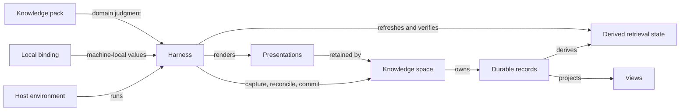
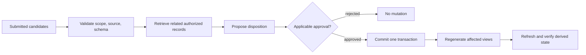

# Architecture

## Architectural objective

The architecture provides one small, provider-neutral protocol for expanding knowledge
predictably while keeping private content, domain reasoning, machine configuration, and
harness implementation in their natural ownership boundaries.

Two kinds of change stay local:

- improving universal lifecycle mechanics requires no private knowledge and no
  domain-pack edit;
- improving domain judgment or a concrete knowledge space requires no harness release.

## System topology



The topology contains exactly nine roles: host environment, harness, knowledge pack,
knowledge space, local binding, durable records, derived retrieval state, views, and
presentations. Each role has exactly one owner, listed below.

## Responsibility boundaries

Ownership is exclusive: a role's listed responsibilities belong to its owner and to no
other component.

| Role | Owner | Owns | Must not own |
| --- | --- | --- | --- |
| Host environment | The host | Execution substrate: agent loop, session lifecycle, provider and model integration, base interaction surface | Knowledge policy, transaction mechanics, domain judgment |
| Harness | The harness | Universal mechanics: capture, scope and provenance preservation, guarded retrieval, reconciliation proposals, transaction and approval enforcement, derived-state refresh and verification, view and presentation rendering, presentation receipts, safe observations | Private knowledge, domain conclusions, any host dependency |
| Knowledge pack | The pack | Reusable domain judgment: candidate kinds, source validity, evidence grading, scope meaning, controlled vocabulary, view templates, domain validators | Space instances, credentials, active knowledge, generic transaction mechanics |
| Knowledge space | The space | Private durable records: evidence, claims, decisions and recommendations, concrete views and audiences, retained presentation artifacts, policy instances, content mappings | Harness implementation, reusable package distribution |
| Local binding | The machine and its user | Machine-local values: paths, credentials, provider restrictions, derived-state and session locations, enabled pack versions | Portable knowledge, reusable domain policy |
| Durable records | The space | The authoritative, human-readable corpus; every active claim traceable to evidence, scope, policy, and approval | Anything that is not inspectable without the harness |
| Derived retrieval state | The harness | The disposable, reproducible retrieval projection of the active space's authorized records, refreshed and verified after commits | Source-of-truth status, authorization decisions |
| Views | The harness | Rendering of audience-independent semantic projections from authorized records | New evidence, changed meaning |
| Presentations | The harness | Rendering of views for audiences under delivery contracts, and retention of presentation receipts | Evidence status, changed actions |

View, audience, and delivery definitions and retained presentation artifacts live in the
space as durable configuration; the harness renders from them and never treats them as
evidence.

## Enforcement boundaries

Enforcement splits into two kinds of rule with two different enforcers.

### Harness-enforced transaction rules

The harness enforces these rules regardless of how it is invoked:

- every candidate record remains inactive until the applicable disposition is applied;
- non-additive durable change requires the applicable approval before commit;
- all validated changes of one operation commit as one logical transaction, or none do;
- state transitions follow the minimum states of the knowledge model;
- derived retrieval state is refreshed and verified after a commit; a failure there
  never changes which durable records are authoritative.

### Host-enforced session rules

The host enforces these rules because it owns session lifecycle:

- a knowledge-aware session resolves exactly one primary knowledge space before any
  knowledge read or write;
- switching the primary space starts a fresh session without conversational carryover;
- where the host cannot control session lifecycle, the machine registers one space and
  the harness validates every operation against it — a weaker guarantee that is
  reported as such.

### Missing guarantees are stated, never implied

An invariant that a given invocation form cannot enforce is reported as validated rather
than enforced. Status output names which rules are enforced and which are only
validated. The architecture never claims a stronger guarantee than the invocation
provides.

## Session and space binding

A binding connects one installed harness to one knowledge space without committing
machine-local or secret values: authorized durable roots, pack and schema compatibility,
derived-state location, session storage location, provider restrictions, concrete views,
audiences, and deliveries, and export policy.

The binding is not portable knowledge and must not become a second implementation.

Derived sensitive data: raw sessions, derived retrieval state, caches, retrieval
receipts, and presentations may reveal the knowledge from which they were derived. They
inherit the space's sensitivity and storage policy even when they are rebuildable.

## Knowledge transaction boundary

The transaction is the unit of durable change:



Packs participate in validation, retrieval policy, reconciliation reasoning, and view
rendering. They return proposals to the core rather than writing around it.

The transaction plan lists every intended durable mutation before approval. Rejection
leaves authoritative records unchanged. Partial-write recovery and derived-state
staleness are explicit; a derived-state failure never changes which durable records are
authoritative.

## Retrieval boundaries

### Transaction-internal retrieval

Reconciliation retrieves related records through a guarded adapter scoped to the active
space. Results are untrusted locators: the harness accepts only locators that resolve
beneath the active records root and re-reads the current record before it is used. A
miss, malformed output, a foreign locator, a path escape, and invalid current content
are distinct failures; each produces no plan.

### Model-facing guarded retrieval

A harness-owned operation resolves the active space and pack policy before invoking an
approved local search mechanism. It returns compact excerpts or structured records,
stable source references, relevance and source-class information when available, an
explicit miss below the threshold, and a receipt retained with material downstream
reasoning or presentations.

The model-facing surface has no cross-space query parameter: a model cannot discover
sibling space names or override the bound space.

### Derived retrieval state is not authorization

Filtering by the derived retrieval state is never treated as authorization.
Authorization is applied against the space boundary before any record is retrieved or
rendered.

## View and presentation boundary

View, audience, delivery, and presentation are separate runtime inputs:

```text
authorized records --view--> semantic projection
                                  + audience contract
                                  + delivery contract
                                  = presentation + receipt
```

Authorization filters records before generation. A renderer may tailor communication but
cannot mutate evidence or active claims. A changed action becomes a distinct decision or
recommendation referenced by the presentation.

Presentations are stored separately from source evidence, or clearly marked, so routine
retrieval does not launder audience-shaped prose back into the corpus.

## Pack and space compatibility

A portable space manifest declares identifiers, schema versions, required packs, and
logical content mappings without credentials or absolute machine paths. A local binding
resolves machine-specific values.

Compatibility is checked at session start. Incompatibility fails with a concrete
diagnostic rather than silently applying a newer pack to an unsupported space.

Migrations belong to the component that owns the changed contract: the harness migrates
universal protocol changes, a pack migrates its domain schema or view templates, and a
space changes its own private policy or content. Existing knowledge layouts may map
through an adapter; adopting the harness is not a reason to rewrite a mature corpus.

## Spaces and subjects

Multiple related subjects may share one space when ownership and privacy are shared.
Physical separation is preferred when subjects have different consent, confidentiality,
or retention obligations.

Each operation resolves exactly one active space. Cross-space retrieval and automatic
generalization are closed by default. Cross-space publication, when later justified,
creates a new reviewed record in the target space and never exposes sibling-space
content by default.

## Release boundary

A release contains the harness, schemas, migrations, synthetic examples, and
compatibility metadata. It contains no pack module, space list, private manifest
instance, local binding, credential, session, index, embedding, presentation, or
knowledge record.

Consuming environments use versioned, immutable releases and do not change installed
behavior in place. Space-owned knowledge is a runtime input, not release content. An
upgrade may require an explicit space migration but never mutates private knowledge
silently at installation time.

## Security and privacy invariants

- The active space constrains all knowledge reads, writes, retrieval, sessions, and
  derived data.
- Derived retrieval state is not treated as authorization.
- Private knowledge never becomes a harness test, log, observation, or release input.
- Audience authorization is applied before records are rendered.
- Non-additive knowledge mutation is visible and gated.
- Cross-space retrieval and automatic generalization are closed by default.
- Observation export cannot read active-space content and performs no network action.
- When evidence sensitivity is uncertain, omit it and reproduce behavior synthetically.

## Change-locality rules

1. Put universal lifecycle behavior in the harness only after at least two current
   contexts demonstrate the seam or a hard boundary requires central enforcement.
2. Put domain judgment in a pack, private instances in a space, and machine values in a
   binding.
3. Keep invocation-layer host dependencies out of the harness; depend on the derived
   retrieval mechanism through an equally narrow seam.
4. Prefer one vertical transaction over a general repository or workflow abstraction.
5. Add schema fields only when a current record or invariant needs them.
6. Do not hide changed decisions inside presentation logic.
7. Remove duplicated accumulation plumbing when the shared protocol proves it can own
   the behavior.
8. Treat any recurring cross-component edit or boundary leak as an observation.
