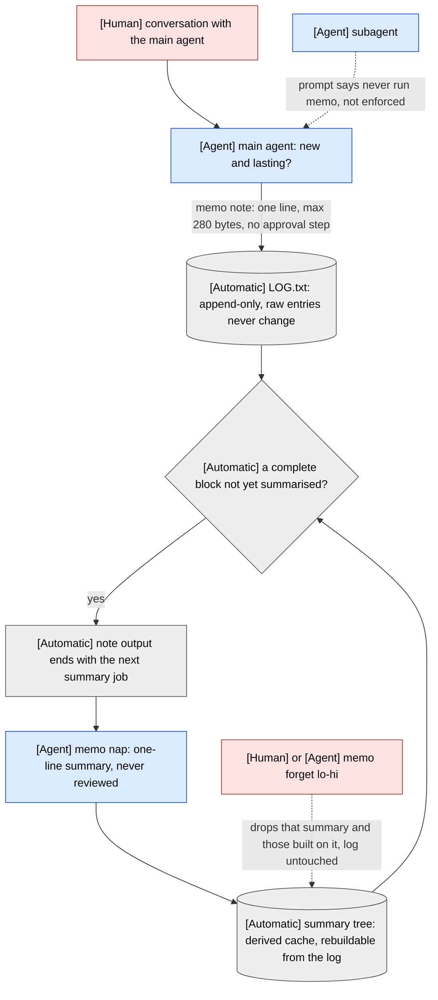
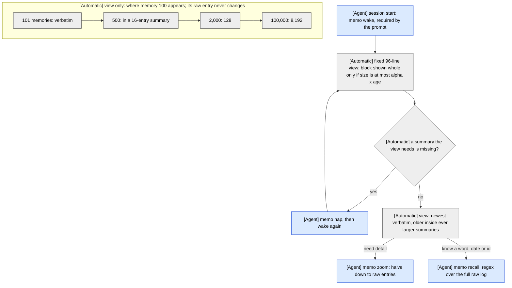
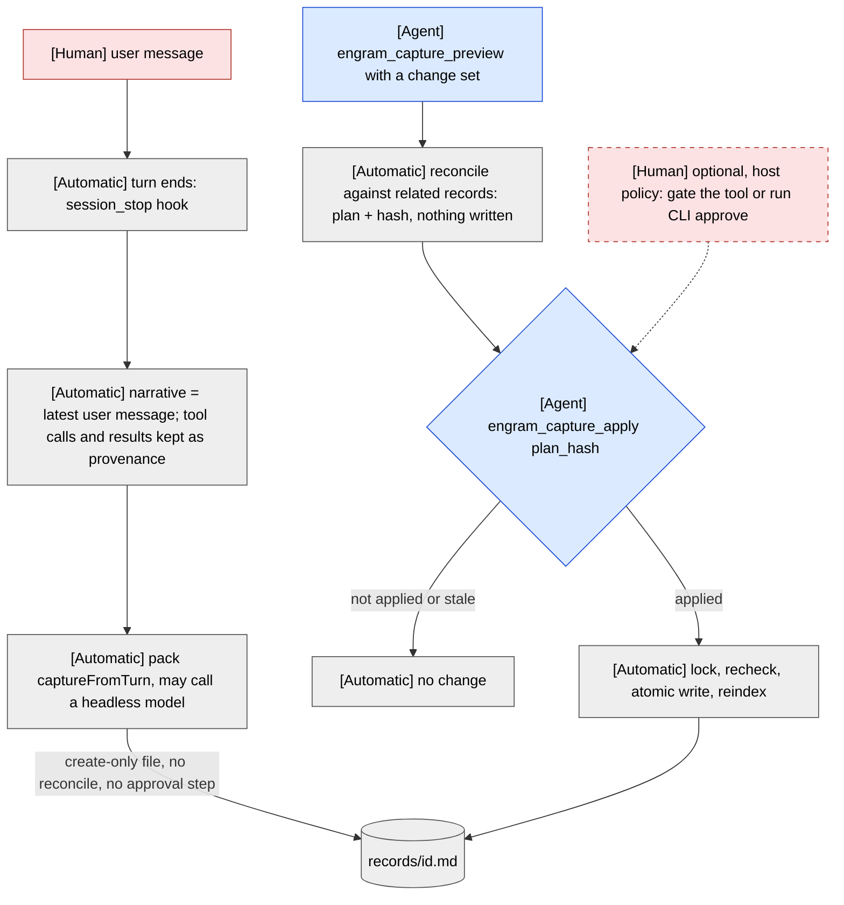
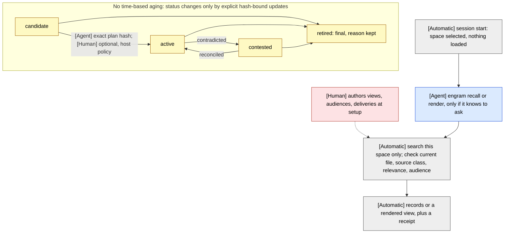

# OptMem vs engram: memory generation, recall, and aging

Snapshots: OptMem [`1fb164c`](https://github.com/VictorTaelin/OptMem/tree/1fb164cf39028047781f72ac3bb1e5a691c1dcb0)
(`memo`, `test.py`, `README.md`); engram `349e40f`.

Node labels name the actor:

- **[Human]** — a person acts. Dashed human nodes are optional and depend on host policy;
  neither runtime has a built-in human approval step.
- **[Agent]** — the model working in the session decides or acts.
- **[Automatic]** — the tool or harness acts with no judgment call.

## 1. OptMem — generate and compress

Blocks of 16 memories or fewer are summarised from raw entries; larger blocks from their two
half-summaries. Summary work totals fewer than T summaries for T memories, and one note triggers
at most about log2(T).

## 2. OptMem — wake and recall; only the view ages

Wake layout at 2,000 memories, oldest to newest (96 lines): 4×128, 12×64, 11×32, 12×16, 11×8,
11×4, 9×2, 26×1. Computed with the pinned `cover()`.

## 3. engram — generate (ambient and explicit)

## 4. engram — pull recall; lifecycle state instead of aging

## Caveats

- **OptMem:** the raw log stays exact. Summaries are derived cache records that `memo forget`
  can drop and a later `nap` rebuilds; `recall` and `zoom` recover raw detail. The subagent ban is
  prompt text only.
- **engram status:** every status change on an existing record needs the exact plan hash. Creating
  a record does not, and the core does not force new records to start as `candidate`, so a pack
  can create `active` records directly — including on the ambient path, where the host does not
  inspect file content.
- **engram recall** is a CLI command, not one of the adapter's registered tools
  (`engram_status`, `engram_capture_preview`, `engram_capture_apply`).
- **Unconfirmed:** whether engram's `session_stop` hook runs in subagent sessions.
